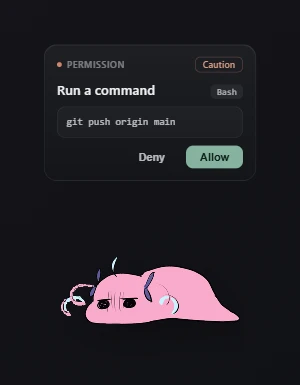
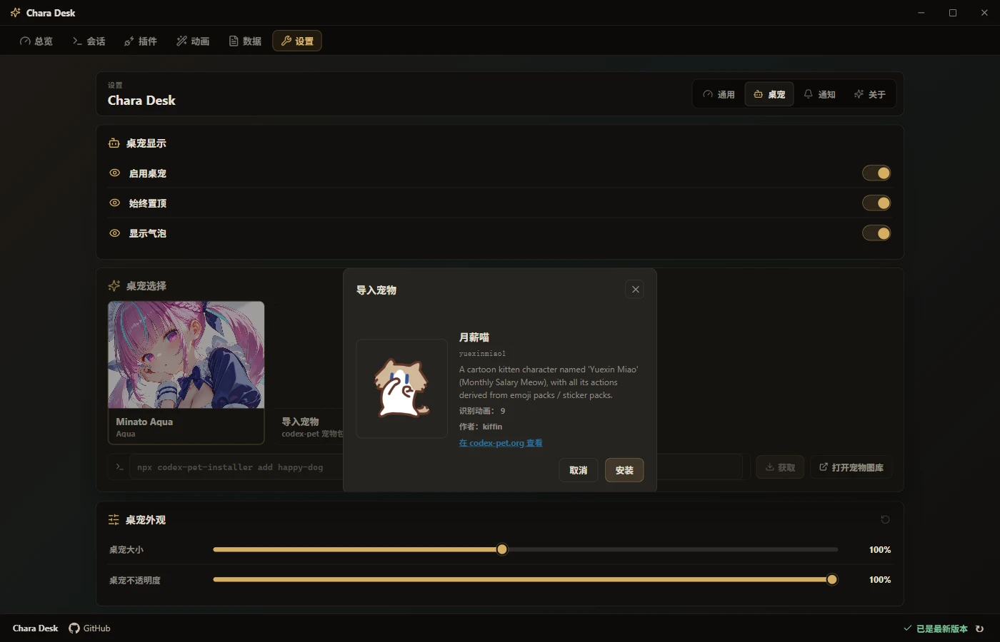
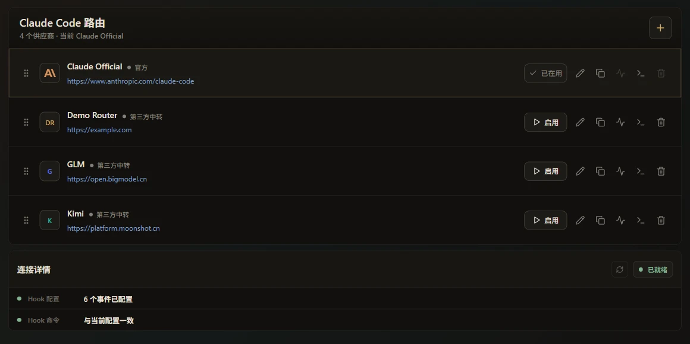
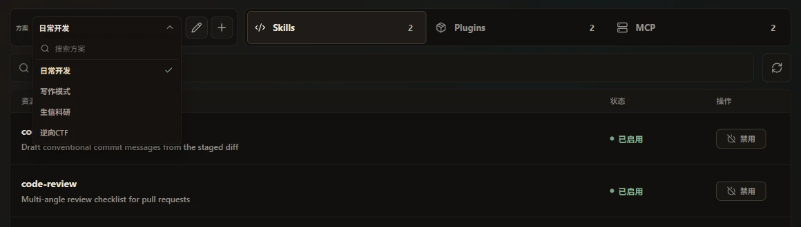
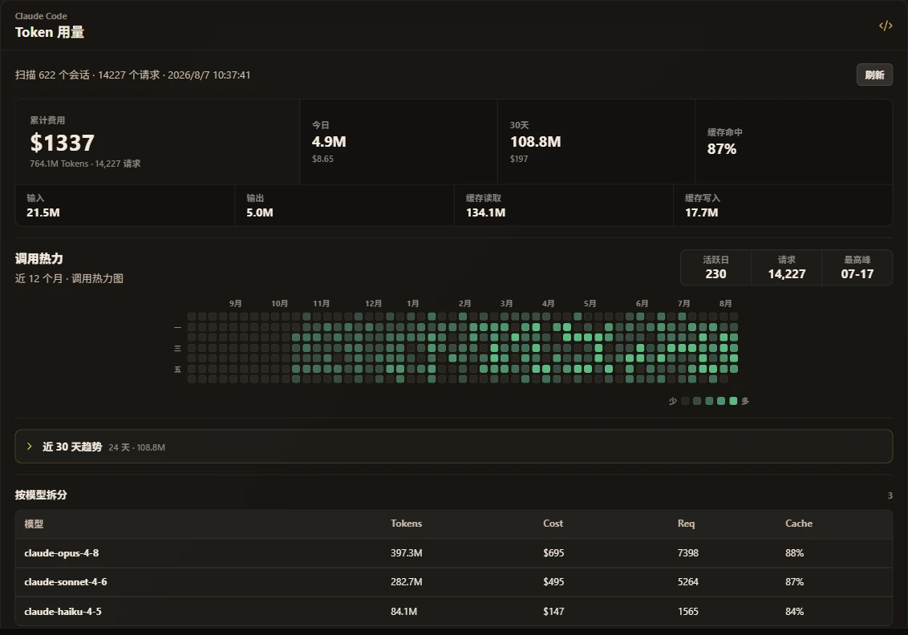

<p align="center">
  
</p>

<h1 align="center">Chara Desk</h1>

<p align="center">
  <sub>
    🌐&nbsp;
    <a href="README.md">简体中文</a>
    &nbsp;·&nbsp; <b>English</b>
  </sub>
</p>

<p align="center">
  <em>A desktop pet and local workbench for Claude Code.</em>
</p>

<p align="center">
  <sub>Live desktop pet · Usage dashboard · Provider switching · Skills / Plugins / MCP management — Windows</sub>
</p>

<p align="center">
  
  &nbsp;
  
  &nbsp;
  <a href="https://github.com/Renakoni/chara-desk/releases/latest"></a>
</p>

<p align="center">
  <a href="#features">Features</a> ·
  <a href="#install">Install</a> ·
  <a href="#build-from-source">Build from source</a> ·
  <a href="#license-and-attribution">License</a>
</p>

> [!NOTE]
> **Unofficial fan project** — the default pet is fan art of Minato Aqua; the character belongs to COVER Corp. This project is not affiliated with COVER or Anthropic. See [License and attribution](#license-and-attribution).

---

## About

Chara Desk is a Windows desktop app for Claude Code, made of two halves: a desktop pet and a local workbench.

The pet listens to Claude Code hook events — session start, tool calls, task completion, errors, permission requests — and reacts with animations in real time. Pet themes use the [codex-pet](https://codex-pet.org) package format.

The workbench brings together token usage, session history, provider switching, and unified management of Skills, plugins, and MCP servers with switchable profiles. Everything runs on your machine.

---

## Features

### Desktop pet

- One-click Claude Code hook install, with built-in connection diagnostics and repair.
- Session, tool, completion, and error events drive the pet's animations live; every event type can be mapped to a custom action.
- When Claude Code asks for permission, a card pops up right on the desktop — allow or deny without switching back to the terminal.
- Notification rules are configurable per event type.

<p align="center">
  
</p>

### Pet themes · codex-pet compatible

- Works with [codex-pet](https://codex-pet.org) theme packages — import a local file or install straight from the online gallery, with dragging and the full action set working out of the box.
- Ships with the Minato Aqua theme.

<p align="center">
  
</p>

### Provider switching · cc-switch compatible

- Fully compatible with [cc-switch](https://github.com/farion1231/cc-switch): both apps share the same provider store, so edits and switches made in one are picked up by the other.
- Claude settings are backed up before every switch, and a failed write never corrupts your existing config.

<p align="center">
  
</p>

### Skills / Plugins / MCP workbench

- Manage personal Skills, user-scope plugins, and global MCP servers in one place — no more hand-editing config files.
- Profiles: save a set of Skills + plugins + MCP servers as a template and switch the whole set in one click, with automatic backups and instant rollback.

<p align="center">
  
</p>

### Usage dashboard

- Token heatmap, per-model and per-project rankings, and cost estimates, all scanned locally from `~/.claude`.
- Runtime stats: tool call counts, session counts, and your most active hours.
- Browse past sessions and resume any of them in one click.

<p align="center">
  
</p>

### Privacy

- All statistics are computed locally; the hook forwarder sends event metadata only — never session content or secrets.
- Sensitive paths and content can be masked across the UI with a single toggle.

---

## Install

Requires **Windows 10 / 11 x64**, [Claude Code](https://claude.com/claude-code) installed, and [Node.js](https://nodejs.org/) on `PATH` (the hook forwarder runs on your system Node).

1. Download `CharaDesk-Setup-*.exe` from [Releases](https://github.com/Renakoni/chara-desk/releases/latest) and install it.
2. Alpha builds are unsigned — when SmartScreen warns, choose "More info → Run anyway".
3. Launch the app, install the hooks with one click from the Overview page, then start a new Claude Code session.

---

## Build from source

```powershell
npm install
npm run dev:electron   # development mode (Vite hot reload)
npm run dist:win       # build the Windows installer into release/
```

Before submitting changes, run `npm test` and `npm run typecheck`. See `package.json` for the remaining scripts.

---

## License and attribution

The code is released under the [MIT License](LICENSE).

This is an **unofficial** fan project:

- **Minato Aqua** — the artwork in the default theme is fan-made derivative work; the character belongs to COVER Corp. and the respective artists. Non-commercial use only, in line with the [hololive derivative works guidelines](https://hololivepro.com/terms/).
- **Clawd Companion** — parts of the UI and the event pipeline evolved from [Clawd Companion](https://github.com/Doulor/Clawd-Companion) (MIT © Doulor).

## Acknowledgements

Special thanks to [Clawd Companion](https://github.com/Doulor/Clawd-Companion) for the early inspiration — Chara Desk's pet UI and event pipeline started there.

The hooks and permission protocol of [Claude Code](https://claude.com/claude-code) are what make the live reactions and permission cards possible.

Provider compatibility builds on [cc-switch](https://github.com/farion1231/cc-switch), and the pet theme ecosystem comes from [codex-pet](https://codex-pet.org)'s open format and online gallery.

Chara Desk is built with [Electron](https://www.electronjs.org/), [React](https://react.dev/), and [Vite](https://vite.dev/), and uses [LiteLLM](https://github.com/BerriAI/litellm)'s model pricing data for local cost estimates. Thanks to all of these projects and their maintainers.

---

<p align="center"><sub><em>A desktop pet and local workbench for Claude Code.</em></sub></p>
